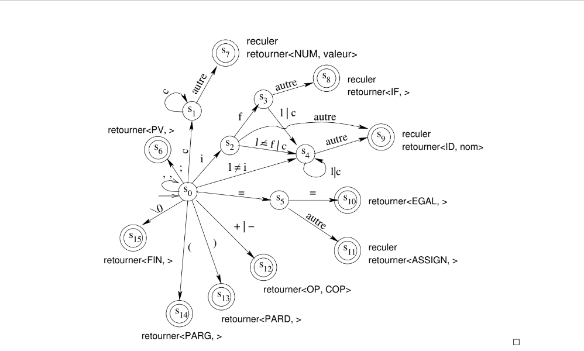

# Lexical Analyzer in C

## Overview  
This project is a **Lexical Analyzer 'Scanner'** implemented in C, designed to tokenize a simple programming language. The lexical analyzer takes a source code string as input and breaks it down into meaningful tokens such as keywords, identifiers, numbers, operators, and punctuation marks. It uses a **Deterministic Finite Automaton 'DFA'** to classify and process tokens effectively.

 .

## Features  
- **Token Classification**: Identifies various tokens like `IF`, `ID`, `NUM`, `OP`, and more.  
- **Attribute Extraction**: Extracts attributes such as numeric values and operator types.  
- **Error Handling**: Provides detailed error messages with character positions for invalid input.  
- **Dynamic Memory Allocation**: Efficiently manages memory for identifiers and other dynamic content.  
- **Modular Design**: Includes reusable components like:
  - `car_suivant` for character reading.
  - `get_lexeme` for lexeme extraction.
  - `reculer` for backtracking positions.

## Getting Started  

### Prerequisites  
- A C compiler 'e.g., `gcc`'.  
- Basic understanding of the C programming language and lexical analysis.

### Compilation  
1. Clone this repository:  
   ```bash
   git clone https://github.com/your-username/lexical-analyzer-c.git
   cd lexical-analyzer-c

2. Compile the program: 
    ```bash 
    gcc * -o lexical_analyzer

### Usage 
1. Run the compiled program
    ```bash
    ./lexical_analyzer

2. Enter a source code string when prompted. For example: 
    ```scss 
    if 'x = 42' x = y+5+max;

3. The output will display a sequence of tokens and their attributes, like: 
    ```bash 
    <IF, >
    <PARG, >
    <ID, x>
    <ASSIGN, >
    <NUM, 42>
    <PARD, >
    <ID, x>
    <ASSIGN, >
    <ID, y>
    <OP, PLUS>
    <NUM, 5>
    <OP, PLUS>
    <ID, max>
    <PV, >
    <FIN, >

### Project Structure 
    ```makefile
    lexical-analyzer-c/
    ├── main.c                # Main driver program
    ├── include.c             # Header and utility functions
    ├── README.md             # Project documentation
    ├── Other utility fonctions # tocken_suivant, car_suivant, reculer,get_lexeme...
    ```

### Fonctionality 
#### Token Types 
    * FIN: End of program.
    * PV: Semicolon ';'.
    * IF: Keyword if.
    * ASSIGN: Assignment operator '='.
    * OP: Operators '+, -'.
    * PARG: Opening parenthesis '('.
    * PARD: Closing parenthesis ')'.
    * ID: Identifier 'e.g., variable names'.
    * NUM: Numbers (e.g., 42)

### Error handling 
When an invalid character is encountered, the program outputs an error message indicating the position and the problematic character. For example:
    ```bash 
    position 5: the character '@' is illegal!


### Contributing
Contributions are welcome! If you’d like to improve this project, feel free to fork the repository and submit a pull request.

### License
This project is licensed under the MIT License. See the LICENSE file for details.

### Acknowledgments
This project serves as a learning tool for understanding lexical analysis and compiler construction.
Inspired by classic DFA-based tokenization techniques.